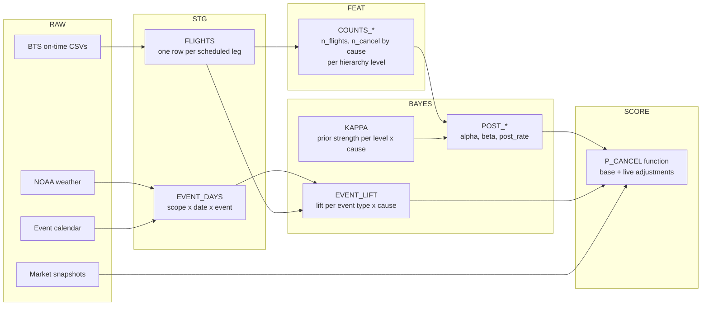

# Flight Cancellation Probability Pipeline

Status: Draft · Last updated: 2026-10-02

We will build a Snowflake pipeline that returns a calibrated P(cancel), with a credible interval, for any scheduled US domestic flight. The estimate is split by cancellation cause so live external signals, such as prediction markets and forecasts, adjust only the cause they affect.

## 1. Context and goals

This is the operational-reliability layer of the risk-adjusted travel product. It feeds Trip Exposure, defined as P(disruption) × money at risk.

**Goals**

- Return P(cancel) and a 90% credible interval for one flight leg, given carrier, flight number, route, date and scheduled departure hour.
- Split the estimate by cause (carrier, weather, air traffic system, security).
- Bring in prediction-market probabilities as live risk adjustments on top of historical base rates.
- Keep v1 in plain SQL so every number can be traced back to its counts.

**Non-goals for v1**

- Delays and missed connections. These come later and reuse the same hierarchy.
- International routes. BTS covers US carriers on domestic flights only.
- Pricing, insurance and booking.

## 2. Modeling approach

v1 is an empirical-Bayes Dirichlet-Multinomial (one Beta-Binomial per cause) with hierarchical shrinkage, computed in SQL. Live external risk is mixed in on top of that base.

**Why Bayesian.** Most specific flights have little history. A flight number with 0 cancellations in 40 departures is not truly 0% risk, and 2 in 10 is not truly 20%. Shrinkage pulls each thin estimate toward its parent level and trusts the flight's own record more as data accumulates. The posterior also gives an honest interval.

| Tier | Method | Runs in | When |
| --- | --- | --- | --- |
| v1 | Empirical Bayes, nested shrinkage per cause | Snowflake SQL | Now |
| v2 | Hierarchical logistic / multinomial regression: random effects for carrier, airport, route; fixed effects for month, hour, day of week | Snowpark Python (PyMC or NumPyro) | After v1 is calibrated |
| v3 | v2 plus time-varying covariates (forecast weather, live market odds) | Snowpark plus scheduled tasks | Trip Watch launch |

v1 is the baseline that v2 must beat on held-out log-loss.

## 3. Data sources

| Source | What we use | Grain | Refresh | Notes |
| --- | --- | --- | --- | --- |
| BTS Reporting Carrier On-Time Performance | FlightDate, Reporting_Airline, Flight_Number_Reporting_Airline, Origin, Dest, CRSDepTime, Cancelled, CancellationCode, Diverted | Flight leg | Monthly, roughly 2 months behind | US domestic only. Reports the *operating* carrier, e.g. SkyWest (OO) flying as United Express. |
| NOAA weather (GHCN daily or a Marketplace share) | Snowfall, precipitation, wind, storm flags by airport | Airport × day | Daily | Labels historical "weather event" days for v1; becomes forecasts in v3. |
| Prediction markets (e.g. Kalshi, Polymarket) | Price history, volume, liquidity, resolution rules | Market × snapshot | Hourly | Coverage of travel events is spotty. Each market must be mapped to a scope (airport, carrier, region) and a date window. |
| Analog event calendar (hand-curated) | Past strikes, shutdowns, ATC outages, hurricanes, with affected scope and dates | Event | As needed | Used to estimate the lift a given event causes in its cause. |

## 4. Pipeline



Everything lives in the `FLIGHT_RISK` database, one schema per layer.

| Schema | Tables / objects | Rebuilt |
| --- | --- | --- |
| `RAW` | `BTS_ONTIME`, `WEATHER_DAILY`, `MARKET_SNAPSHOTS`, `EVENT_CALENDAR`; external stage plus `COPY INTO` | On load |
| `STG` | `FLIGHTS`, `EVENT_DAYS`, `CARRIER_MAP` (marketing to operating carrier) | Monthly task |
| `FEAT` | `COUNTS_CARRIER`, `COUNTS_CARRIER_ORIGIN`, `COUNTS_CARRIER_ROUTE`, `COUNTS_ROUTE_SEASON`, `COUNTS_FLIGHT` | Monthly task |
| `BAYES` | `KAPPA`, `POST_*` (one per level), `EVENT_LIFT` | Monthly task |
| `SCORE` | `P_CANCEL(...)` UDTF, `MARKET_LATEST` view | Live; markets hourly |

### STG.FLIGHTS

```sql
create or replace table STG.FLIGHTS as
select
    flightdate::date                                as dep_date,
    reporting_airline                               as carrier,
    flight_number_reporting_airline                 as flight_no,
    origin, dest,
    floor(crsdeptime / 100)                         as dep_hour,
    case when floor(crsdeptime / 100) < 10 then 'AM'
         when floor(crsdeptime / 100) < 16 then 'MID'
         else 'PM' end                              as hour_band,
    month(flightdate)                               as dep_month,
    cancelled::int                                  as cancelled,
    nullif(cancellationcode, '')                    as cause      -- A carrier, B weather, C NAS, D security
from RAW.BTS_ONTIME
where flightdate >= '2015-01-01';
```

## 5. Hierarchy and shrinkage

The hierarchy runs from coarse to specific. Each level's prior is its parent's posterior.

```
global
 └─ carrier
     └─ carrier × origin
         └─ carrier × route
             └─ carrier × route × month × hour band
                 └─ carrier × flight number × route
```

Each flight has five possible outcomes: not cancelled, or cancelled for cause A, B, C or D. For each level and cause k, the update is:

```
post_rate_k = (cancels_k + κ_k · parent_rate_k) / (flights + κ_k)
α_k         = cancels_k + κ_k · parent_rate_k
β_k         = (flights − cancels_k) + κ_k · (1 − parent_rate_k)
```

The causes are mutually exclusive, so P(cancel) = Σ_k post_rate_k. Using one κ per level for all causes is exactly a Dirichlet prior. A separate κ per cause is a close approximation and is easier to tune.

**Output.** Scoring returns all five outcomes as percentages that sum to 100%, each cause with its own 90% interval. Example from the web prototype (sample data) for UA 1423 ORD → LGA, Dec 14, 07:05, with the ORD snow market at 34%:

| Outcome | P | 90% interval |
| --- | --- | --- |
| Flies as scheduled | 95.8% | |
| Cancelled · weather (B) | 3.1% | 1.5–6.2% |
| Cancelled · carrier (A) | 0.56% | 0.17–1.6% |
| Cancelled · air traffic (C) | 0.56% | 0.15–1.7% |
| Cancelled · security (D) | <0.01% | <0.01–0.38% |
| **P(cancel)** | **4.2%** | 2.4–7.2% |

Percentages show two decimals below 1% and one above, so small causes do not round to 0%.

**Choosing κ.** Start with a grid search per level: try κ in {10, 30, 100, 300, 1000} and keep the value with the lowest held-out log-loss. A method-of-moments estimate can serve as the starting point:

```
τ² = weighted variance of child rates − mean of m(1 − m)/n_i
κ  = m(1 − m)/τ² − 1
```

Here m is the parent rate and n_i is each child's flight count.

**Recency.** Weight counts with an exponential decay on flight date, a 3-year half-life to start. Exclude Mar 2020–Jun 2021 (COVID schedule collapse).

### SQL sketch for one level

`FEAT` tables cross join the four causes so that zero-cancel groups still get rows.

```sql
create or replace table BAYES.POST_CARRIER_ROUTE as
select
    f.carrier, f.origin, f.dest, f.cause,
    f.n_flights, f.n_cancel,
    p.post_rate                                                as prior_rate,
    k.kappa,
    (f.n_cancel + k.kappa * p.post_rate) / (f.n_flights + k.kappa) as post_rate,
    f.n_cancel + k.kappa * p.post_rate                         as alpha,
    f.n_flights - f.n_cancel + k.kappa * (1 - p.post_rate)     as beta
from FEAT.COUNTS_CARRIER_ROUTE f
join BAYES.POST_CARRIER_ORIGIN p
  on p.carrier = f.carrier and p.origin = f.origin and p.cause = f.cause
join BAYES.KAPPA k
  on k.level = 'carrier_route' and k.cause = f.cause;
```

**Unseen groups.** A new flight number or route has no row at its own level. Scoring walks up the hierarchy with `coalesce` and uses the deepest level that exists.

**Intervals.** Snowflake has no built-in Beta quantile function. A Python UDF calling `scipy.stats.beta.ppf(q, α, β)` returns the 5% and 95% bounds per cause. For total P(cancel), sample from the Dirichlet in the UDF.

## 6. External-event adjustments

Each live signal adjusts only the cause it acts on. The cause codes are what make this possible.

| Signal | Cause adjusted | Scope |
| --- | --- | --- |
| Airline or pilot strike market | A (carrier) | Carrier |
| Airport worker strike market | A, C | Airport |
| Government shutdown or ATC disruption market | C (air traffic system) | National |
| Hurricane or winter storm market; v3 forecasts | B (weather) | Airport or region |
| Security incident | D | Airport |

**Lift from analog days.** For each event type and cause, estimate how much the event multiplies the cancellation rate, using `STG.EVENT_DAYS` joined to `STG.FLIGHTS` within the event's scope:

```
L_k = rate_k on event days / rate_k on comparable non-event days
```

This lift gets its own Beta-shrunk estimate, because there are few past events of each type.

**Mixing in a live probability.** The historical base rate already includes past events at their historical frequency q_hist. Remove that first, then apply the live probability q from the market:

```
p_k(no event) = p_k / (q_hist · L_k + 1 − q_hist)
p_k'          = p_k(no event) · (q · L_k + 1 − q)
```

When q = q_hist, this returns the base rate unchanged.

**Market hygiene**

- Ignore markets below a minimum liquidity or volume.
- Smooth prices over a 6-hour window.
- Check that the resolution rule matches the trip. "Strike announced" is not the same as "strike in effect on the travel date".
- Store the full price history, because movement such as 12% → 34% drives Trip Watch alerts.

## 7. Evaluation and calibration

| Check | Method | Pass bar (v1) |
| --- | --- | --- |
| Out-of-time accuracy | Train on 2015–2023, test on 2024–2025 | Log-loss and Brier below both baselines |
| Baselines | Global rate; raw carrier × route rate | |
| Calibration | Reliability curve by predicted-risk decile | Each decile within ±20% relative of observed |
| Thin-data behavior | Metrics split by flight-level sample size (<50, 50–500, >500) | Shrinkage wins most where n < 50 |
| Event adjustment | Backtest on held-out analog events (e.g. 2018–19 shutdown) | Adjusted rate closer to observed than base |

## 8. Open decisions

- [ ] **Data in Snowflake today.** Is anything loaded, or do we start by staging BTS CSVs? Is there a weather Marketplace share?
- [ ] **Prediction horizon.** Booking-time (weeks to months out, mostly base rates plus markets) or close-in (days out, where forecasts dominate)?
- [ ] **Hierarchy order.** Should airport sit above carrier? Airport effects (snow at ORD, congestion at EWR) may beat carrier effects.
- [ ] **Season and hour.** Keep them nested at route level, or treat them as separate multiplicative factors to avoid thin cells?
- [ ] **Carrier mapping.** User itineraries show the marketing carrier, while BTS shows the operating carrier. Where does the mapping come from?
- [ ] **Recency weighting.** Is a 3-year half-life and the COVID exclusion right?

## 9. Roadmap

1. Load BTS 2015–present into `RAW`; build `STG.FLIGHTS`.
2. Build `FEAT` counts and `BAYES` posteriors for all levels; tune κ.
3. Write the `SCORE.P_CANCEL` UDTF with fallback and intervals; run evaluation.
4. Curate the event calendar; estimate `EVENT_LIFT`.
5. Ingest market snapshots hourly; wire live adjustments into scoring.
6. v2 hierarchical model in Snowpark; compare against v1.
